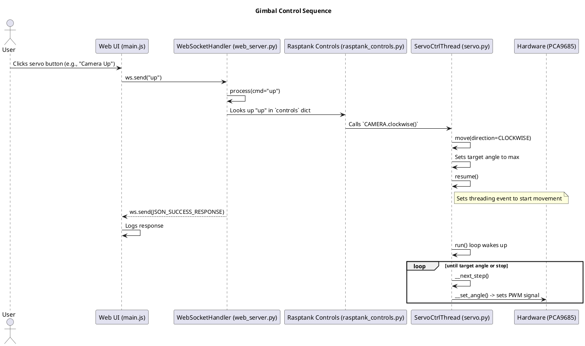

# US_0002: Gimbal/Servo Control

**ID:** US_0002

**Title:** Gimbal/Servo Control

**What & Why:**
As an End User, I want to control the camera gimbal (pan/tilt) with configurable limits and centering, so that I can aim the camera for better situational awareness during navigation.

### Feature Items (How & Who)
- **US_0002_FI_0001:** Servo positioning and calibration
  - How: PWM control with min/max pulse width limits; center command resets to midpoint
  - Who: Robotics Engineer / `src/controllers/servo.py`
- **US_0002_FI_0002:** Web UI gimbal controls
  - How: Joystick or buttons for pan/tilt; real-time updates via WebSocket
  - Who: Web Developer / `controller_web/main.js`
- **US_0002_FI_0003:** Safety clamping and limits
  - How: Enforce configured travel limits; log overshoots
  - Who: Software Engineer / `src/controllers/servo.py`, `src/hardware/pca9685_controller.py`
- **US_0002_FI_0004:** Telemetry for servo positions
  - How: Expose current angles via API/UI
  - Who: Software Engineer / `src/web_server.py`

### Acceptance Criteria (BDD scenarios)
- **US_0002_AC_0001:** Pan/tilt commands adjust camera angles within configured min/max limits (±2% tolerance).
- **US_0002_AC_0002:** Center command positions both axes within ±2° of configured midpoint.
- **US_0002_AC_0003:** Response latency ≤ 50 ms from UI action to servo movement on Pi 4.
- **US_0002_AC_0004:** Web UI provides operable pan/tilt controls reachable within ≤ 2 taps.

### Traceability
- Related requirements: `FR_002` (Gimbal/Servo Control), `NFR_003` (Performance), `NFR_005` (Usability)
- Related user story items: US_0002_FI_0001..0004
- Links back: See `documentation/requirements.md` for FR_002 details.

### Testing Strategy
- **Test Types:** Unit, Integration, End-to-End, Performance
- **Unit tests:**
  - `tests/controllers/test_servo.py` — test positioning, limits, and calibration
- **Integration/E2E tests:**
  - `tests/test_webpage_clicks_e2e.py` — UI gimbal controls validated
- **Coverage Goals:** Achieve ≥80% code coverage for `src/controllers/servo.py`.
- **Test Approach per AC:**
  - AC_0001 (limits): unit tests for clamping logic; verify no movement beyond limits.
  - AC_0002 (centering): unit tests for center command; hardware verification on Pi models.
  - AC_0003 (latency): measure UI action to servo response; use performance tests.
  - AC_0004 (UI): browser automation tests; ensure controls on mobile viewports.

### Code modules
- Implementation: `src/controllers/servo.py`, `src/hardware/pca9685_controller.py`, `controller_web/main.js`
- Tests: `tests/controllers/test_servo.py`, `tests/test_webpage_clicks_e2e.py`

### Design artifacts to produce
- Servo calibration diagram
- Gimbal control sequence diagram

### Design Artifacts

#### Servo Calibration Diagram
*Description based on code:*
- Each servo (ARM, HAND, WRIST, CLAW, CAMERA) initializes to 90 degrees.
- Movement range: 0 to 180 degrees.
- Direction: Clockwise (1) or Anticlockwise (-1), adjustable per servo.
- Speed: Adjustable (default 1), affects step size per time unit.
- Calibration: Servos reset to initial position via `reset()` method.
- Threaded operation: Continuous movement in a daemon thread until stopped.

#### Gimbal Control Sequence Diagram
This diagram illustrates the flow for controlling a servo, like the camera gimbal, from the UI to the hardware.

*Note: The servo movement runs in a background thread, allowing the server to respond to the UI immediately while the hardware moves.*

### Implementation tasks (backlog suggestions)
- **T1:** Implement servo positioning and limits (US_0002_FI_0001) — Priority: High, Effort: 2 days, Status: Pending
- **T2:** Add web UI gimbal controls (US_0002_FI_0002) — Priority: Medium, Effort: 1-2 days, Status: Pending
- **T3:** Enforce safety clamping (US_0002_FI_0003) — Priority: High, Effort: 1 day, Status: Pending
- **T4:** Add telemetry for positions (US_0002_FI_0004) — Priority: Medium, Effort: 1 day, Status: Pending

### Last Updated
October 12, 2025
