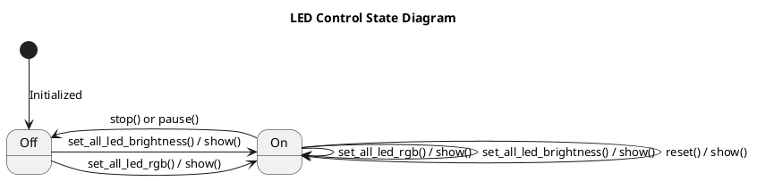

# US_0003: LED/Lighting Control

**ID:** US_0003

**Title:** LED/Lighting Control

**What & Why:**
As an End User, I want to control onboard LEDs for illumination and status indication, so that I can enhance visibility and monitor robot state.

### Feature Items (How & Who)
- **US_0003_FI_0001:** LED on/off and brightness control
  - How: PWM-based brightness levels; on/off commands
  - Who: Software Engineer / `src/controllers/leds.py`
- **US_0003_FI_0002:** Web UI LED controls
  - How: Buttons/sliders for LED control; real-time feedback
  - Who: Web Developer / `controller_web/main.js`
- **US_0003_FI_0003:** Predefined color modes
  - How: Support for common colors (red, green, blue, etc.)
  - Who: Software Engineer / `src/controllers/leds.py`

### Acceptance Criteria (BDD scenarios)
- **US_0003_AC_0001:** LED on/off commands reflect at hardware within 2 seconds.
- **US_0003_AC_0002:** Brightness adjustments map linearly (±10% tolerance) across at least 5 levels.
- **US_0003_AC_0003:** Predefined colors are selectable and accurate.
- **US_0003_AC_0004:** Controls available in main UI, operable within ≤ 2 taps.

### Traceability
- Related requirements: `FR_003` (LED/Lighting Control), `NFR_005` (Usability)
- Related user story items: US_0003_FI_0001..0003
- Links back: See `documentation/requirements.md` for FR_003 details.

### Testing Strategy
- **Test Types:** Unit, Integration, E2E
- **Unit tests:**
  - `tests/controllers/test_leds.py` — test on/off, brightness, colors
- **Integration/E2E tests:**
  - `tests/test_webpage_clicks_e2e.py` — UI LED controls
- **Coverage Goals:** Achieve ≥80% code coverage for `src/controllers/leds.py`.
- **Test Approach per AC:**
  - AC_0001 (on/off): unit tests for state changes; hardware timing verification.
  - AC_0002 (brightness): unit tests for PWM mapping; linearity checks.
  - AC_0003 (colors): unit tests for predefined modes.
  - AC_0004 (UI): browser tests for accessibility.

### Code modules
- Implementation: `src/controllers/leds.py`, `controller_web/main.js`
- Tests: `tests/controllers/test_leds.py`, `tests/test_webpage_clicks_e2e.py`

### Design artifacts to produce
- LED control state diagram

### Design Artifacts

#### LED Control State Diagram
This state diagram shows the operational states of the `LedCtrl` module.

*Note: The `LedCtrl` class manages the state of the LED strip. Any command that changes color or brightness transitions the system to an "On" state by writing new values to the SPI device. The `stop()` or `pause()` command turns the LEDs off.*

### Implementation tasks (backlog suggestions)
- **T1:** Implement LED on/off and brightness (US_0003_FI_0001) — Priority: Medium, Effort: 1-2 days, Status: Pending
- **T2:** Add web UI controls (US_0003_FI_0002) — Priority: Low, Effort: 1 day, Status: Pending
- **T3:** Support predefined colors (US_0003_FI_0003) — Priority: Low, Effort: 0.5 days, Status: Pending

### Last Updated
October 12, 2025
