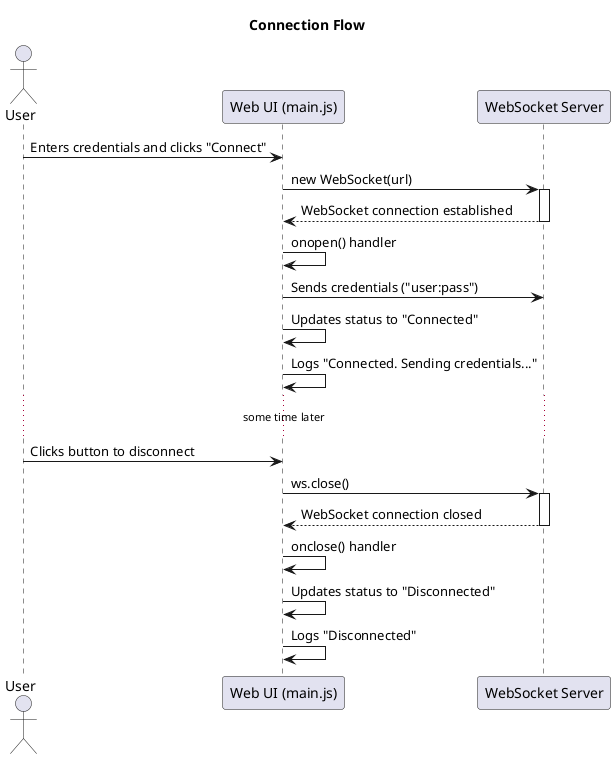
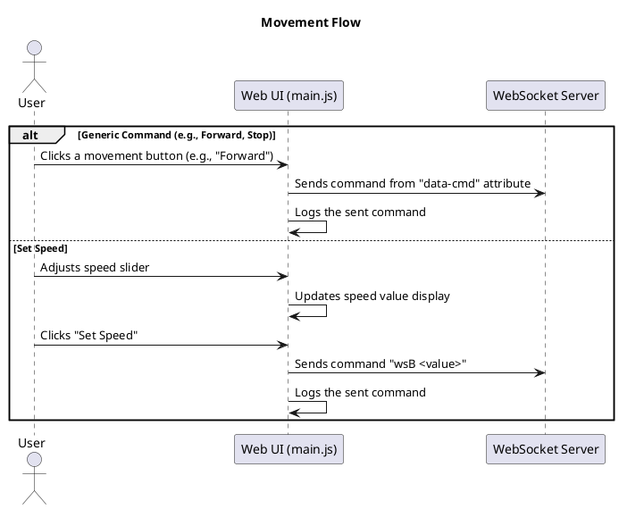
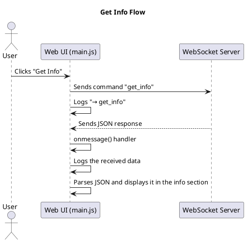

# US_0007: Web Control UI

**ID:** US_0007

**Title:** Web Control UI

**What & Why:**
As an End User, I want a web interface for full robot control, so that I can operate it from any supported browser.

### Feature Items (How & Who)
- **US_0007_FI_0001:** Unified control dashboard
  - How: Single page with drive, servo, LED, video controls
  - Who: Web Developer / `controller_web/index.html`, `controller_web/main.js`
- **US_0007_FI_0002:** Connection management
  - How: Host/port settings and connection status
  - Who: Web Developer / `controller_web/main.js`
- **US_0007_FI_0003:** Mobile responsiveness
  - How: Layouts for 360–414 px viewports
  - Who: Web Developer / `controller_web/styles.css`

### Acceptance Criteria (BDD scenarios)
- **US_0007_AC_0001:** UI exposes drive, servo, LED, and stream controls from mobile browser.
- **US_0007_AC_0002:** Basic actions reachable within ≤ 2 clicks/taps.
- **US_0007_AC_0003:** Connection settings allow host/port configuration.

### Traceability
- Related requirements: `FR_007` (Web Control UI), `NFR_005` (Usability)
- Related user story items: US_0007_FI_0001..0003
- Links back: See `documentation/requirements.md` for FR_007 details.

### Testing Strategy
- **Test Types:** E2E, Manual
- **E2E tests:**
  - `tests/test_webpage_clicks_e2e.py` — control interactions
- **Coverage Goals:** ≥60% for UI components.
- **Test Approach per AC:**
  - AC_0001 (exposes controls): E2E tests for presence.
  - AC_0002 (reachability): usability tests for tap counts.
  - AC_0003 (connection): E2E tests for settings.

### Code modules
- Implementation: `controller_web/*`, `src/web_server.py`
- Tests: `tests/test_webpage_clicks_e2e.py`, `tests/test_webpage_with_mock.py`

### Design artifacts to produce
- UI wireframes and interaction diagrams

### Design Artifacts

#### UI Wireframes and Interaction Diagrams

**Wireframe Overview:**
The web UI is a single-page application with a responsive layout using cards for sections. It includes:
- **Header:** Title and description.
- **Connection Section:** Form inputs for host, port, username, password; connect button; status badge.
- **Movement Section:** Grid of buttons (Forward, Backward, Left, Right, Stop); speed slider (0-100) with value display and set button.
- **Servos Section:** Extensive grid of buttons for arm, hand, wrist, claw, camera controls, plus home button.
- **Info Section:** Button to get info; pre-formatted display area for JSON data.
- **Log Section:** Scrollable log area for real-time messages.

**Interaction Diagrams:**

**Mobile Responsiveness:** Uses flexbox and grid layouts; viewports 360-414px supported with stacked elements.

### Implementation tasks (backlog suggestions)
- **T1:** Build unified dashboard (US_0007_FI_0001) — Priority: High, Effort: 4-5 days, Status: Pending
- **T2:** Add connection management (US_0007_FI_0002) — Priority: Medium, Effort: 1-2 days, Status: Pending
- **T3:** Ensure mobile responsiveness (US_0007_FI_0003) — Priority: Medium, Effort: 2 days, Status: Pending

### Last Updated
October 12, 2025
